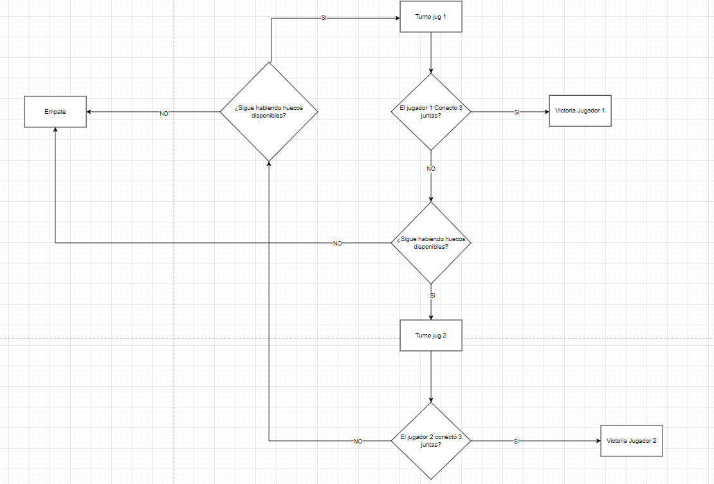

## JavaScript 3

> Tarea Intermedia

### 🔍 Análisis del problema

Se va a realizar el tres en raya con javascript

#### 🤔 ¿Como se hará?

Dispondremos de un turno por cada jugador  hasta que uno de los dos conecte tres, de forma horizontal, vertical o diagonalmente. El tablero será una tabla de 3x3 mientras que el jugador uno pintara x y el jugador dos pintara o en el tablero.

**¿Como se finaliza la partida?**

Cuando uno de los dos jugadores conecta tres, saldrá una alerta con el nombre del jugador que ganó y se añadirá un punto a su contador de victorias. En el caso de que ninguno gane saldra una alerta de empate y se añadirá un punto al contador de empates

---

### 📐 Diseño de la solución

Para realizar este apartado de Tarea Intermedia, he creado una tabla usando html y he conectado el script con las instrucciones y funciones necesarias para cumplir los objetivos especificados anteriormente

**UML de ejemplo para la solución**

---